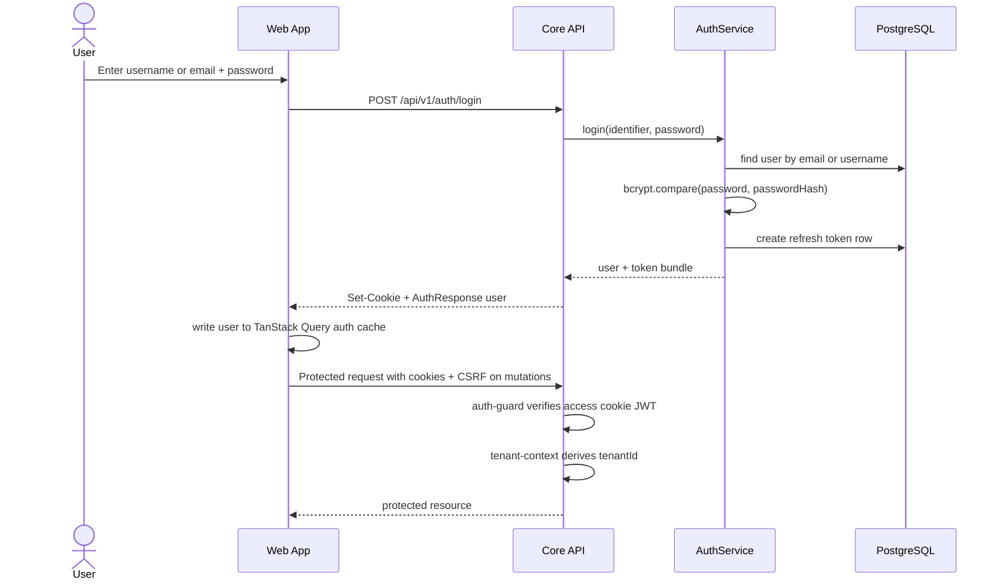
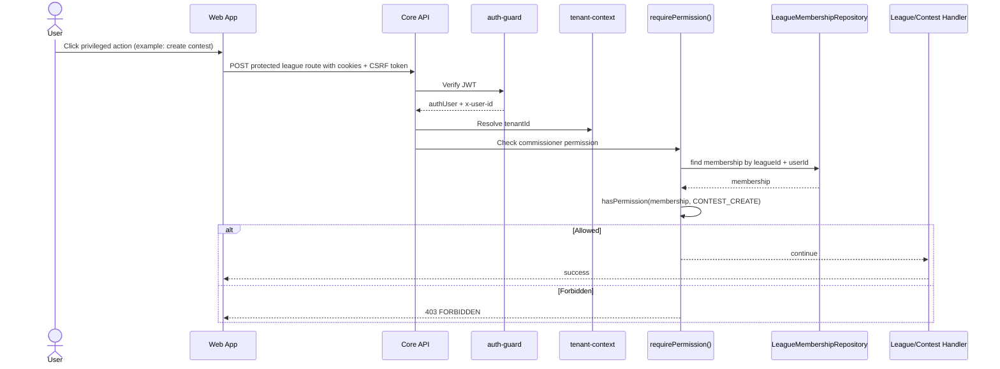
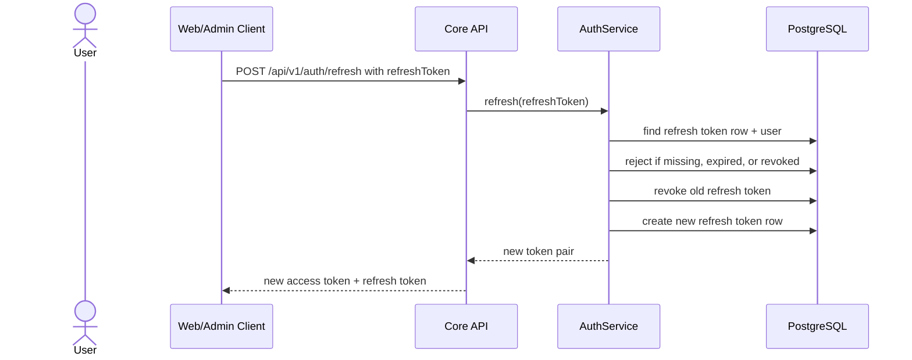
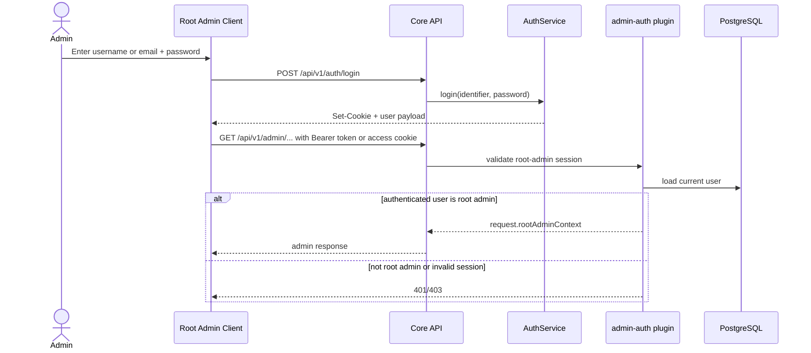
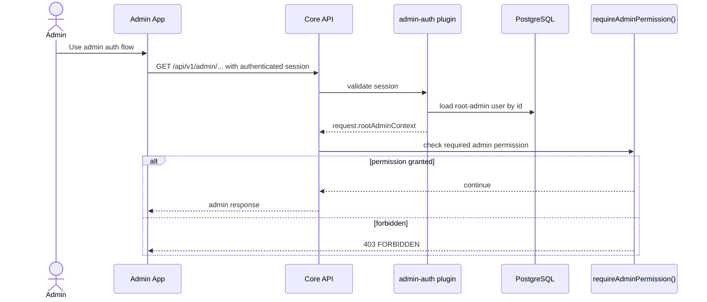
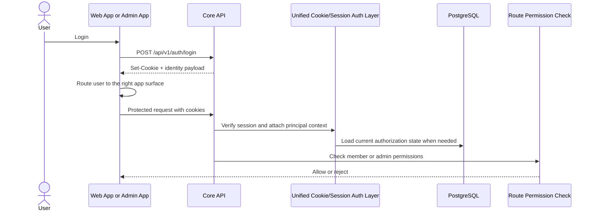

# Authentication And Authorization

> Frontend transition note: legacy references in this document to `clients/web` and `clients/admin` are historical. The active web implementation target is `clients/poolmaster`, and future root-admin UI should be rebuilt there rather than inferred from retired frontend code.

This document describes how authentication and authorization currently work in PoolMaster for:

- the member-facing web app
- the admin app
- the backend API enforcement layers behind both

This is intentionally a **current-state** document. It describes what the code does today, including remaining deferred auth surface that still needs product or implementation follow-up.

## Terms

- **Authentication**: proving who the caller is
- **Authorization**: deciding what an authenticated caller is allowed to do
- **Access token**: JWT used on authenticated API requests, normally carried by
  the backend-owned access cookie for browser clients
- **Refresh token**: opaque token stored in Postgres and exchanged for a new access token
- **Tenant**: the logical workspace boundary used by the member-facing app

## High-Level Summary

### Web app

- Uses username-or-email/password login via `POST /api/v1/auth/login`
- Receives backend-owned access, refresh, and CSRF cookies plus an identity payload
- Does not store JWTs in browser JavaScript state
- Sends cookies automatically and attaches `X-CSRF-Token` for mutating requests
- Backend validates the JWT with the shared auth guard
- Tenant context is derived from authenticated request context and league membership
- Route-level authorization is based on:
  - authenticated user identity
  - league membership
  - commissioner permissions for league-scoped privileged actions

### Admin app

- Root-admin backend routes currently reuse the same authenticated user session established through `POST /api/v1/auth/login`
- Requests can authenticate with:
  - `Authorization: Bearer ...`
  - or the backend-owned access cookie
- Backend admin routes use the scoped root-admin auth plugin at runtime
- The live runtime gate checks the authenticated user row and requires `isRootAdmin=true`
- There is a defined admin role/permission model in code, but it is **not currently the live runtime gate**

## Backend Authentication Components

### 1. Public auth routes

Defined in [packages/core-api/src/modules/auth/routes.ts](../packages/core-api/src/modules/auth/routes.ts):

- `POST /api/v1/auth/register`
- `POST /api/v1/auth/login`
- `POST /api/v1/auth/refresh`
- `POST /api/v1/auth/logout`
- `POST /api/v1/auth/forgot-password`
- `POST /api/v1/auth/callback`
- `GET /api/v1/auth/me`

These routes are exempt from the global JWT guard.

### 2. Shared JWT auth guard

Defined in [packages/core-api/src/plugins/auth-guard.ts](../packages/core-api/src/plugins/auth-guard.ts).

It:

- skips public routes:
  - `/health`
  - `/api/v1/auth/*`
- requires a bearer token or backend-owned access cookie on protected routes
- requires a matching CSRF header for state-changing cookie-session requests
- verifies the JWT
- attaches `request.authUser = { userId, email, isRootAdmin, sessionId }`
- also writes `x-user-id` into the request headers for backward compatibility with older handlers

### 3. Tenant context plugin

Defined in [packages/core-api/src/core/tenant-context.ts](../packages/core-api/src/core/tenant-context.ts).

It resolves tenant identity in this order:

1. `request.authUser.tenantId`
2. `x-tenant-id` header

If neither exists for a protected route, the request is rejected with `401`.

## PoolMaster Web App Authentication

### Login flow

The active login page lives at [auth-home-page.tsx](../clients/poolmaster/src/features/auth/auth-home-page.tsx).

It:

- collects username-or-email plus password
- calls `loginUser({ client, body })`
- relies on backend-managed auth cookies; JWTs are not stored in browser JavaScript state
- stores the authenticated user in the TanStack Query `['poolmaster', 'auth', 'me']` cache
- navigates to `/welcome`, `/manage` for root admins, or the requested redirect target

The active web API client is configured in [api.ts](../clients/poolmaster/src/lib/api.ts).

It automatically attaches:

- `credentials: 'include'`
- `X-Client-Trace-Id`
- `X-Client-Request-Id`
- `X-CSRF-Token` for mutating requests when the `poolmaster_csrf` cookie is present

The active auth session cache helpers are in [auth-session-cache.ts](../clients/poolmaster/src/features/auth/auth-session-cache.ts).

They use:

- TanStack Query as the single source of truth for current-user server state
- `AUTH_ME_QUERY_KEY` for the current user
- `clearAuthSession` for logout and failed-refresh cleanup

### Web authentication sequence



## Web App Authorization

### Identity-level authorization

For most protected member-facing routes, the first gate is simply:

- valid JWT
- valid tenant context

### League-scoped authorization

For league and contest operations, PoolMaster adds league membership and commissioner permission checks.

Core permission logic:

- [packages/core-api/src/core/permissions.ts](../packages/core-api/src/core/permissions.ts)
- [packages/core-api/src/core/require-permission.ts](../packages/core-api/src/core/require-permission.ts)
- [packages/core-api/src/modules/leagues/permissions.ts](../packages/core-api/src/modules/leagues/permissions.ts)

Important rules:

- `COMMISSIONER` has implicit access to all commissioner permissions
- `COMMISSIONER` has only the permissions explicitly stored on the membership

Examples enforced today:

- invite members
- remove members
- change member roles
- manage league lifecycle and settings
- create contests

### Web authorization sequence for a league-scoped action



### Practical web authorization behavior

- authenticated but not a member of a league:
  - generally gets `403`
- authenticated member without commissioner privileges:
  - can read member-level pages
  - cannot perform privileged commissioner actions
- owner:
  - bypasses commissioner-permission granularity and has full commissioner power in that league

Negative-path coverage exists in:

- [tests/integration/core-api/permission-negative.integration.ts](../tests/integration/core-api/permission-negative.integration.ts)

## Token Lifecycle

### Access token

Issued by [packages/core-api/src/modules/auth/auth-service.ts](../packages/core-api/src/modules/auth/auth-service.ts).

Current behavior:

- JWT
- includes:
  - `sub`
  - `email`
  - `tenantId`
  - `iat`
  - `exp`
- default expiry: 15 minutes

### Refresh token

Current behavior:

- opaque UUID, not a JWT
- persisted in Postgres `refreshToken`
- default expiry: 7 days
- rotated on refresh
- revoked on logout by setting `revokedAt`

### Refresh sequence



## Retired Admin Frontend Note

The separate admin frontend has been retired. Future root-admin browser flows should be rebuilt in `clients/poolmaster` rather than inferred from the old admin app.

Admin/backend authorization details below remain relevant for server-side root-admin route design, but old browser implementation details should be treated as historical context only.

## Root Admin Authorization

### Backend design in production code

There is a dedicated admin auth plugin at [packages/core-api/src/plugins/admin-auth.ts](../packages/core-api/src/plugins/admin-auth.ts).

That plugin currently:

- resolves the access token from either the `Authorization` header or the backend-owned access cookie
- validates the JWT
- loads the real `User` row from Postgres
- requires `isRootAdmin=true`
- attaches `request.rootAdminContext`

The broader admin permission model already exists and includes:

- roles:
  - `SUPER_ADMIN`
  - `OPERATIONS`
  - `SUPPORT`
  - `DATA_OPS`
  - `VIEWER`
- permissions like:
  - `tenant.view`
  - `contest.override`
  - `sportsdata.configure`
  - `platform.health`
  - `audit.view`

### Actual runtime admin authorization today

The live admin module in [packages/core-api/src/modules/admin/routes.ts](../packages/core-api/src/modules/admin/routes.ts) **does** register the dedicated root-admin auth plugin.

Current runtime admin authorization is therefore:

- require an authenticated access token or access cookie
- verify the token
- load the current user row
- require `isRootAdmin=true`
- attach `request.rootAdminContext`

What is still deferred is finer-grained root-admin role/permission enforcement. The codebase still contains a broader admin role/permission model, but the active runtime gate today is the root-admin boolean check.

### Admin current-state authentication/authorization sequence



### Deferred admin target sequence

This is the next likely direction if root-admin authorization grows beyond the current boolean gate:



## Current Web vs Admin Differences

| Concern | Web app | Admin app |
|---|---|---|
| Login endpoint | `POST /api/v1/auth/login` | currently also `POST /api/v1/auth/login` |
| Access token storage | Backend-managed auth cookie | same authenticated session or cookie model |
| User store | TanStack Query `AUTH_ME_QUERY_KEY` | same webapp auth cache |
| Auth header | Cookie-based session plus CSRF header for mutations | Cookie-based session plus root-admin gate |
| Extra identity headers | none | none required |
| Backend auth gate | real JWT auth guard | real root-admin auth plugin |
| Tenant enforcement | yes | not central in admin flow |
| Runtime role/permission enforcement | yes for many league-scoped actions | role model exists, but not the current runtime gate |

## Security And Correctness Observations

### Stronger areas today

- member-facing authentication is coherent and end-to-end
- JWT access tokens are enforced on protected member routes
- tenant context is derived centrally
- league-scoped authorization has concrete permission helpers and negative integration coverage
- refresh tokens are persisted and rotated

### Weak or transitional areas today

- admin login is not a separate hardened root-admin auth flow
- admin role/permission checks exist in code, but are not currently the primary runtime authorization layer
- SSO is still placeholder UI/backlog behavior, not the actual live auth mechanism
- `/api/v1/auth/me` manually re-verifies the token inside the handler rather than reusing the shared auth context directly

## Recommended Changes

### Recommended direction: one authentication model, two application surfaces

Yes, the architecture would be cleaner if PoolMaster used **one authentication model** for both the web app and admin app:

- one login/authentication flow
- one backend-owned cookie/session model
- one way to identify the caller
- one way to derive authorization from coarse identity plus database-backed policy

The web and admin apps can still remain separate frontends and separate route spaces, but they do not need separate authentication mechanics.

### Why a unified cookie/session model is better

Current state:

- web uses a real JWT auth guard
- active web auth uses backend-owned cookies plus CSRF protection
- root-admin routes use the live root-admin plugin on top of the authenticated user session
- admin role/permission logic exists, but it is not the live runtime gate

That creates avoidable complexity:

- remaining split between current root-admin capability checks and the fuller admin role model
- higher risk of drift between frontend and backend
- more code paths to test

A unified model would reduce this to:

1. login once
2. backend issues `HttpOnly` auth/session cookies
3. frontend reads authenticated identity from the backend, not from token storage
4. every protected request carries cookies automatically
5. backend validates the session/JWT
6. backend resolves the caller’s permissions/roles
7. route-level authorization decides whether the request is allowed

### Recommended target design

#### Authentication

Use a single auth flow for both web and admin users:

- `POST /api/v1/auth/login`
- or a future SSO/OIDC login flow

The backend should own session issuance and renewal through `HttpOnly` cookies:

- short-lived auth/session cookie
- refresh cookie with explicit revocation lifecycle
- `Secure` outside local development
- explicit `SameSite` and cookie-domain configuration
- no browser-readable access-token persistence

The authenticated session identity should identify:

- subject/user id
- email
- tenant id when applicable
- whether the principal has admin capabilities
- optionally the admin role and/or permission version

Example conceptual coarse claims/session fields:

```json
{
  "sub": "user-or-admin-id",
  "email": "derek.dorazio@gmail.com",
  "tenantId": "tenant-123",
  "principalType": "user",
  "adminRole": "SUPER_ADMIN",
  "isAdmin": true,
  "iat": 1710000000,
  "exp": 1710000900
}
```

Not every user needs every field, but the model should be consistent. The browser should not need to decode or store these values directly.

#### Authorization

Authentication and authorization should stay separate:

- verified cookie-backed session proves identity
- authorization decides what that identity can do

For member-facing routes:

- continue using league membership + commissioner permission checks

For admin routes:

- keep using the existing `admin-auth` plugin
- attach `request.rootAdminContext`
- use `requireAdminPermission()` where appropriate

### Should authorization information live in the session token?

Partially, yes, but with care.

Best practice here is:

- include **stable coarse-grained identity claims** in the cookie-backed session token
  - `sub`
  - `email`
  - `tenantId`
  - `isAdmin`
  - maybe `adminRole`
- do **not** rely exclusively on a long-lived browser session token as the only source of fine-grained authorization truth

Why:

- admin permissions can change
- league membership permissions can change
- role removals need to take effect quickly

So the practical recommendation is:

- the session token carries enough information to classify the caller
- backend still loads current authorization state for sensitive scopes

That means:

- web routes can keep using DB-backed league membership lookups
- admin routes can load the current admin user and check current permissions

### Recommended redirect behavior

Yes, redirect based on role/capability after login, but do it as a frontend routing decision backed by truthful identity data.

A good model is:

- if the authenticated user is a normal member user:
  - send them to the web app dashboard
- if the authenticated user has admin capability:
  - allow entry to the admin app
- if a user can access both:
  - either choose a default landing area or provide an app switcher

Important detail:

- redirecting based on role is a UX decision
- it should not be the security boundary
- the backend authorization checks must still stand on their own

### Concrete recommended changes for PoolMaster

#### 1. Keep browser-supplied admin identity headers out of the trust boundary

The backend should continue to rely on the authenticated session plus server-side root-admin lookup, not browser-supplied identity headers.

#### 2. Keep browser-managed access-token storage retired

The active PoolMaster web app uses backend-owned cookies instead of
browser-managed token persistence. Keep future web/admin surfaces on that model.

That means:

- the browser no longer reads/stores access tokens directly
- frontend app shells hydrate from truthful backend-authenticated identity reads
- refresh, revocation, and logout stay backend-owned

#### 3. Grow root-admin authorization from the existing live plugin

Use [packages/core-api/src/plugins/admin-auth.ts](../packages/core-api/src/plugins/admin-auth.ts) as the runtime root-admin gate and layer any future permission model on top of that live foundation.

#### 4. Decide on one principal model

PoolMaster should explicitly choose one of these:

- **Option A**: one shared principal model where a regular user may also have an admin record/capability
- **Option B**: separate admin principals, but still authenticated through the same JWT/session mechanism

Either can work. What matters most is:

- one token validation path
- one backend trust model

#### 5. Add admin identity claims intentionally

If admin access is part of the same authentication universe, add claims such as:

- `isAdmin`
- `adminRole`
- possibly `principalType`

But continue loading current admin permissions from the database for sensitive routes.

#### 6. Simplify `/api/v1/auth/me`

Once the shared auth/session guard is the universal protected-route entry point, `GET /api/v1/auth/me` should prefer the already-verified request auth context instead of manually re-parsing a bearer token inside the handler.

### Recommended target sequence



### Bottom-line recommendation

Yes, I recommend moving to:

- one authentication flow
- one backend-owned cookie/session validation path
- one backend trust model
- separate authorization rules for member and admin capabilities

And specifically:

- keep access tokens out of `localStorage`
- issue `HttpOnly`, `Secure` auth cookies from the backend
- let the backend own refresh, logout, and revocation

That keeps the browser trust boundary narrow while the remaining admin-role model
work matures on top of the live root-admin plugin.

## Recommended Review Questions

If you are reviewing this architecture, the most important questions are:

1. Should admin authentication move to a truly separate admin login/session path?
2. Or should PoolMaster instead converge on a single cookie/session-based authentication model for both web and admin?
3. Should the live admin module switch from header-based gating to the existing `admin-auth` plugin plus `requireAdminPermission()`?
4. Should the admin app stop synthesizing admin identity headers in the browser once the backend admin plugin is fully live?
5. Should `GET /api/v1/auth/me` rely on the already-populated `request.authUser` instead of re-verifying the session token manually?

## Relevant Code References

### Backend

- [packages/core-api/src/index.ts](../packages/core-api/src/index.ts)
- [packages/core-api/src/plugins/auth-guard.ts](../packages/core-api/src/plugins/auth-guard.ts)
- [packages/core-api/src/core/tenant-context.ts](../packages/core-api/src/core/tenant-context.ts)
- [packages/core-api/src/modules/auth/routes.ts](../packages/core-api/src/modules/auth/routes.ts)
- [packages/core-api/src/modules/auth/handler.ts](../packages/core-api/src/modules/auth/handler.ts)
- [packages/core-api/src/modules/auth/auth-service.ts](../packages/core-api/src/modules/auth/auth-service.ts)
- [packages/core-api/src/core/permissions.ts](../packages/core-api/src/core/permissions.ts)
- [packages/core-api/src/core/require-permission.ts](../packages/core-api/src/core/require-permission.ts)
- [packages/core-api/src/plugins/admin-auth.ts](../packages/core-api/src/plugins/admin-auth.ts)
- [packages/core-api/src/core/admin-permissions.ts](../packages/core-api/src/core/admin-permissions.ts)
- [packages/core-api/src/modules/admin/routes.ts](../packages/core-api/src/modules/admin/routes.ts)

### Frontend

- [api.ts](../clients/poolmaster/src/lib/api.ts)
- [auth-session-cache.ts](../clients/poolmaster/src/features/auth/auth-session-cache.ts)
- [auth-provider.tsx](../clients/poolmaster/src/features/auth/auth-provider.tsx)
- [auth-home-page.tsx](../clients/poolmaster/src/features/auth/auth-home-page.tsx)
