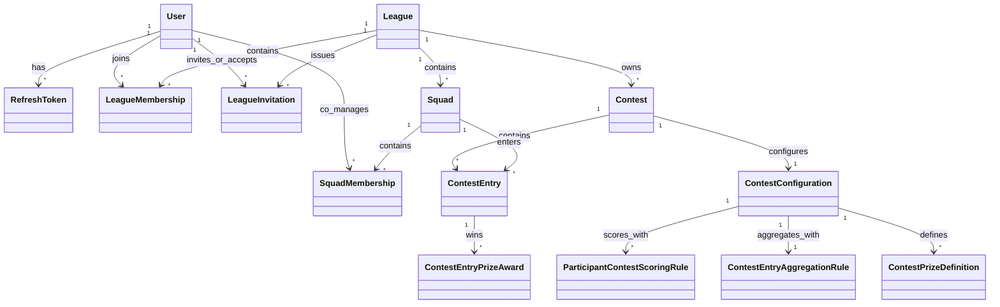
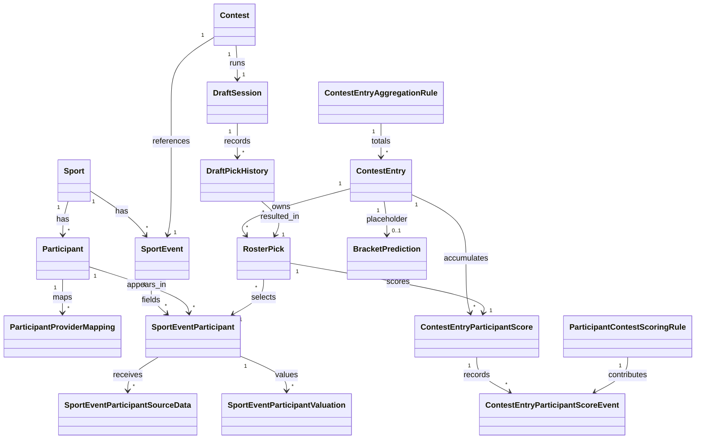
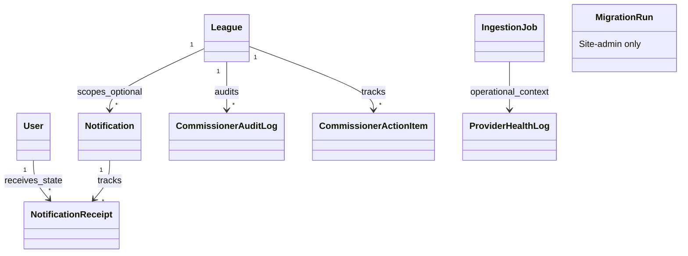

# Database Schema V2

This document describes the **target backend schema direction** after the model
revisions captured in:

- [plans/37-league-top-level-domain-and-data-simplification.md](/Users/DDorazio/Library/CloudStorage/OneDrive-CURRICULUMASSOCIATESLLC/Documents/Claude/pool-master/plans/37-league-top-level-domain-and-data-simplification.md)
- [plans/38-contest-entry-and-squad-alignment-review.md](/Users/DDorazio/Library/CloudStorage/OneDrive-CURRICULUMASSOCIATESLLC/Documents/Claude/pool-master/plans/38-contest-entry-and-squad-alignment-review.md)
- [plans/41-contest-history-user-cases.md](/Users/DDorazio/Library/CloudStorage/OneDrive-CURRICULUMASSOCIATESLLC/Documents/Claude/pool-master/plans/41-contest-history-user-cases.md)
- [plans/42-history-simplification.md](/Users/DDorazio/Library/CloudStorage/OneDrive-CURRICULUMASSOCIATESLLC/Documents/Claude/pool-master/plans/42-history-simplification.md)
- [plans/44-league-first-commissioner-administration-user-cases.md](/Users/DDorazio/Library/CloudStorage/OneDrive-CURRICULUMASSOCIATESLLC/Documents/Claude/pool-master/plans/44-league-first-commissioner-administration-user-cases.md)
- [plans/46-site-administration-user-cases.md](/Users/DDorazio/Library/CloudStorage/OneDrive-CURRICULUMASSOCIATESLLC/Documents/Claude/pool-master/plans/46-site-administration-user-cases.md)
- [plans/47-notification-feed-user-cases.md](/Users/DDorazio/Library/CloudStorage/OneDrive-CURRICULUMASSOCIATESLLC/Documents/Claude/pool-master/plans/47-notification-feed-user-cases.md)
- [plans/48-social-and-notification-simplification.md](/Users/DDorazio/Library/CloudStorage/OneDrive-CURRICULUMASSOCIATESLLC/Documents/Claude/pool-master/plans/48-social-and-notification-simplification.md)
- [plans/49-billing-and-tier-simplification.md](/Users/DDorazio/Library/CloudStorage/OneDrive-CURRICULUMASSOCIATESLLC/Documents/Claude/pool-master/plans/49-billing-and-tier-simplification.md)
- [plans/51-scoring-and-participant-data-review.md](/Users/DDorazio/Library/CloudStorage/OneDrive-CURRICULUMASSOCIATESLLC/Documents/Claude/pool-master/plans/51-scoring-and-participant-data-review.md)

It is intentionally separate from the current-schema reference at
[docs/DATABASE-SCHEMA.md](/Users/DDorazio/Library/CloudStorage/OneDrive-CURRICULUMASSOCIATESLLC/Documents/Claude/pool-master/docs/DATABASE-SCHEMA.md).

## Scope And Conventions

- This is a **target-state** design document, not a description of the current Prisma file.
- Database: PostgreSQL
- Primary key pattern: UUID strings
- Timestamp convention: UTC `timestamptz`
- Audit convention:
  - `createdAt` / `updatedAt` are universal
  - `createdByUserId?` / `updatedByUserId?` may exist on human-authored mutable records
- First pass is explicitly:
  - league-first
  - single-event contests only
  - squad-based contest ownership
  - in-app notifications only
  - no active billing subsystem

### Surface Legend

`Web`
- primarily used by the member-facing app

`Commissioner`
- primarily used by league-scoped commissioner tools

`Site Admin`
- small platform-ops surface outside league scope

`Internal`
- backend jobs, ingestion, scoring, or operational state

## Core Design Summary

The V2 schema centers on these ideas:

- `User` is global
- `League` is the top-level product boundary
- `LeagueMembership` models league participation
- `Squad` is the persistent contest-playing identity inside a league
- `ContestEntry` belongs to a `Squad`
- `Contest` belongs to a `League` and references one `SportEvent`
- `RosterPick` references `SportEventParticipant`
- scoring writes canonical score state back onto `ContestEntry`
- history is derived from core contest data instead of a parallel history subsystem
- notifications are one in-app feed built from `Notification` + `NotificationReceipt`
- billing/tiering is fully deferred

## ERD

### Identity, League, Squad, And Contest Core

### Sport Event, Participants, Selections, And Drafts

### Notifications, Commissioner Audit, And Site Operations

## Data Dictionary

## Identity And Session

| Table | Purpose | Key Columns | Primary Surface |
|---|---|---|---|
| `users` | Global account identity shared across leagues | `id`, `email`, `display_name`, auth fields, locale/timezone fields | `Web` |
| `refresh_tokens` | Session refresh and revocation state | `token`, `user_id`, `expires_at`, `revoked_at` | `Web` |
| `user_locale_preferences` | Per-user display preferences | language, timezone, time/date formats, currency | `Web` |

## League, Membership, And Invitations

| Table | Purpose | Key Columns | Primary Surface |
|---|---|---|---|
| `leagues` | Top-level product boundary and durable league home | `id`, `name`, `description`, `created_by`, `settings` | `Web` |
| `league_memberships` | Durable user membership within a league | `league_id`, `user_id`, `role`, `status`, `status_reason` | `Web` |
| `league_invitations` | Single-use invite records for joining a league | `league_id`, `invite_code`, `email?`, `status`, `invited_by`, `accepted_by?` | `Web` |
| `commissioner_audit_log` | Immutable commissioner action history | `league_id`, `actor_id`, `action`, `before_state`, `after_state` | `Commissioner` |
| `commissioner_action_items` | Commissioner dashboard follow-up items | `league_id`, optional `contest_id`, `type`, `priority`, `resolved` | `Commissioner` |

## Squad And Squad Membership

| Table | Purpose | Key Columns | Primary Surface |
|---|---|---|---|
| `squads` | Persistent contest-playing identity within a league | `league_id`, `name`, `icon_url?`, `status`, `status_reason` | `Web` |
| `squad_memberships` | Co-manager relationship between users and squads | `squad_id`, `user_id`, `status`, `status_reason` | `Web` |

Notes:

- a user can only belong to one squad per league in the current direction
- squads are never deleted, only inactivated
- if the last active manager leaves, the squad becomes inactive

## Sport, Participant, And Event Master Data

| Table | Purpose | Key Columns | Primary Surface |
|---|---|---|---|
| `sports` | Supported sports and high-level sport metadata | `name`, `participant_type`, optional stat/result schema hints | `Internal` |
| `participants` | Global participant identity within a sport | `sport_id`, `name`, `participant_type`, profile fields, metadata | `Both` |
| `participant_provider_mappings` | Provider-to-participant identity mapping | `participant_id`, `provider_id`, `external_id`, `confidence` | `Site Admin` |
| `sport_events` | Real-world imported event/tournament identity and lifecycle | `sport`, `provider_id`, `external_id`, `name`, `start_date_time`, `end_date_time`, `status` | `Both` |
| `sport_event_participants` | Event-scoped participant membership with minimal first-class state | `sport_event_id`, `participant_id`, `status`, `metadata` | `Internal` |
| `sport_event_participant_source_data` | Provider payloads and normalized result data for one event participant | `sport_event_participant_id`, `provider_id`, `external_id`, `raw_payload`, `normalized_data`, `received_at` | `Internal` |
| `sport_event_participant_valuations` | Event-specific PoolMaster valuation for selection contests | `sport_event_participant_id`, `price?`, `tier?`, `order_index?`, `valuation_source` | `Commissioner` |

Notes:

- `SportEventParticipant` is the selection/scoring identity
- heterogeneous sport-specific result data belongs in `normalized_data`
- first pass should keep first-class participant result fields to a minimum

## Contest And Contest Configuration

| Table | Purpose | Key Columns | Primary Surface |
|---|---|---|---|
| `contests` | Core contest identity and lifecycle | `league_id`, `sport_event_id`, `name`, `status` | `Both` |
| `contest_configurations` | Commissioner-managed rules and timing | `contest_id`, `selection_type`, `locks_at`, `minimum_entries` | `Commissioner` |
| `participant_contest_scoring_rules` | Contest-specific configured participant scoring rules | `contest_configuration_id`, `participant_scoring_definition_id`, `sort_order`, `config`, `active` | `Commissioner` |
| `contest_entry_aggregation_rules` | Contest-specific configured entry aggregation rules | `contest_configuration_id`, `aggregation_definition_id`, `config`, `active` | `Commissioner` |
| `contest_prize_definitions` | Contest-specific configured prize definitions | `contest_configuration_id`, `prize_definition_id`, `display_name`, `sort_order`, `rule_config`, payout fields | `Commissioner` |

Recommended `contest_configurations` concerns:

- selection mode and draft rules
- contest-owned scoring rules
- exactly one active contest-owned entry aggregation rule in first pass
- minimum entry count
- lock timing
- prize definitions

Explicitly not needed in first pass:

- contest-local participant pool tables
- contest-local pricing ownership
- season ownership

## Contest Entries, Roster Picks, Drafts, And Prizes

| Table | Purpose | Key Columns | Primary Surface |
|---|---|---|---|
| `contest_entries` | Canonical live and final entry record | `contest_id`, `squad_id`, `entry_number`, `name`, `status`, `total_score`, `standings_position`, `is_eliminated` | `Web` |
| `roster_picks` | Canonical selected-participant records for an entry | `entry_id`, `sport_event_participant_id` | `Web` |
| `draft_sessions` | Runtime state for turn-based drafts, especially snake drafts | `contest_id`, `status`, `current_pick_number`, `current_entry_id`, `current_turn_started_at`, `started_at` | `Web` |
| `draft_pick_history` | Snake-draft replay/history records | `draft_session_id`, `roster_pick_id`, `entry_id`, `pick_number`, `round`, `pick_in_round`, `auto_picked` | `Web` |
| `bracket_predictions` | Minimal placeholder for deferred bracket support | `entry_id`, `predictions`, `tiebreaker_value?` | `Web` |
| `contest_entry_participant_scores` | Current accumulated score contribution for one selected participant on one entry | `entry_id`, `roster_pick_id`, `points_earned` | `Web` |
| `contest_entry_participant_score_events` | Individual scoring contributions produced by participant contest scoring rules | `contest_entry_participant_score_id`, `participant_contest_scoring_rule_id`, `points`, `details_json` | `Web` |
| `contest_entry_prize_awards` | Prize awards attached to an entry | `entry_id`, `contest_prize_definition_id`, resolved display and payout fields, `awarded_at` | `Web` |

Notes:

- `RosterPick` is the canonical selection record
- `DraftPickHistory` exists only for snake-draft replay/history
- participant scoring rules produce `contest_entry_participant_score_events`
- participant score totals roll up through an entry aggregation rule into `ContestEntry.totalScore`
- first pass supports exactly one active `contest_entry_aggregation_rules` row per contest
- `ContestEntry` holds canonical score/rank/elimination state
- multiple entries per squad are supported through `entry_number`

## Scoring And Derived Contest History

| Table | Purpose | Key Columns | Primary Surface |
|---|---|---|---|
| `contest_entries` | Live and final score source of truth | `total_score`, `standings_position`, `is_eliminated`, `status` | `Both` |
| `contest_entry_participant_scores` | Participant-level current score totals for entry breakdowns and aggregation | `entry_id`, `roster_pick_id`, `points_earned` | `Both` |
| `contest_entry_participant_score_events` | Rule-level score event ledger for participant scoring explanation and recompute | `contest_entry_participant_score_id`, `participant_contest_scoring_rule_id`, `points`, `details_json` | `Both` |
| `contest_entry_prize_awards` | Prize outcomes for completed or mid-contest awards | `entry_id`, `contest_prize_definition_id`, `display_name`, `amount?`, `percentage?` | `Both` |
| `roster_picks` | Historical locked roster composition | `entry_id`, `sport_event_participant_id` | `Both` |
| `sport_event_participant_source_data` | Real-world participant results backing score explanations | `normalized_data`, `raw_payload` | `Internal` |

History is intentionally derived from core contest data rather than separate
tables like:

- `contest_standings`
- `contest_results`
- `team_roster_history`
- `payout_history`
- `scoring_checkpoints`

## Notifications

| Table | Purpose | Key Columns | Primary Surface |
|---|---|---|---|
| `notifications` | Canonical in-app notification/message record | `league_id?`, `sender_user_id?`, `sender_display_name`, `type`, `subject`, `body`, `source_type?`, `source_id?` | `Web` |
| `notification_receipts` | Per-user read/dismiss state for notifications | `notification_id`, `user_id`, `read_at?`, `dismissed_at?` | `Web` |

Notes:

- `league_id = null` means site-wide
- active league feed should load league-scoped plus site-wide notifications
- no push/email/sms/digest subsystem in first pass

## Site Administration And Operations

| Table | Purpose | Key Columns | Primary Surface |
|---|---|---|---|
| `migration_runs` | Site-admin migration execution history | run name, status, started/completed timestamps, output metadata | `Site Admin` |
| `ingestion_jobs` | Import/poll job history and outcomes | `job_type`, `provider_id`, `sport`, `status`, processed/error counts | `Site Admin` |
| `provider_health_log` | Provider reliability and latency trend snapshots | `provider_id`, `status`, error rate, latency, failures, `recorded_at` | `Site Admin` |

Site-admin should remain small and focused on:

- provider/ingestion operations
- platform health
- migrations
- limited platform config
- audit

## Explicit Removals And Deferrals

The following areas are intentionally outside the V2 target schema:

### Removed from the active model

- `tenants`
- tenant-scoped billing/subscription tables
- tenant-scoped usage and entitlement tables
- contest-local pool tables
- separate standings/result/history snapshot tables
- broad social/chat/feed tables

### Deferred for later focused design

- bracket-specific normalized prediction schema
- pick'em / survivor-specific persistence model
- payment providers and billing
- platform-wide announcements as a separate subsystem
- global feature-flag and override systems
- trophies, rivalry records, season summaries, and other rich analytics/history layers

## Suggested Table Inventory

The following list summarizes the target first-pass backend model after the
current simplification wave:

- `users`
- `refresh_tokens`
- `user_locale_preferences`
- `leagues`
- `league_memberships`
- `league_invitations`
- `commissioner_audit_log`
- `commissioner_action_items`
- `squads`
- `squad_memberships`
- `sports`
- `participants`
- `participant_provider_mappings`
- `sport_events`
- `sport_event_participants`
- `sport_event_participant_source_data`
- `sport_event_participant_valuations`
- `contests`
- `contest_configurations`
- `participant_contest_scoring_rules`
- `contest_entry_aggregation_rules`
- `contest_prize_definitions`
- `contest_entries`
- `roster_picks`
- `draft_sessions`
- `draft_pick_history`
- `bracket_predictions`
- `contest_entry_participant_scores`
- `contest_entry_participant_score_events`
- `contest_entry_prize_awards`
- `notifications`
- `notification_receipts`
- `ingestion_jobs`
- `provider_health_log`
- `migration_runs`

## Notes For Final Review

The most important remaining design area after this document is the final
scoring and participant-data review in
[plans/51-scoring-and-participant-data-review.md](/Users/DDorazio/Library/CloudStorage/OneDrive-CURRICULUMASSOCIATESLLC/Documents/Claude/pool-master/plans/51-scoring-and-participant-data-review.md).

That review will confirm:

- the exact `SportEventParticipant` shell fields
- the exact `SportEventParticipantSourceData` payload expectations
- the final provider import/update behavior for participant scoring rebuilds
- any later scoring-rule expansions beyond the launch rule set
