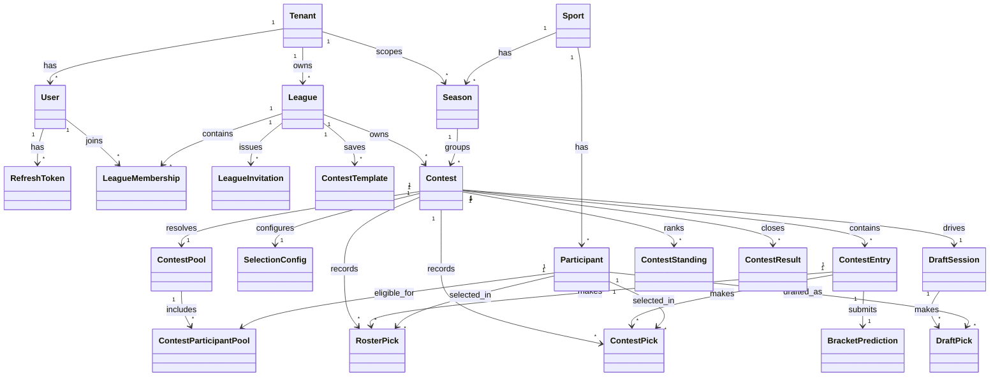
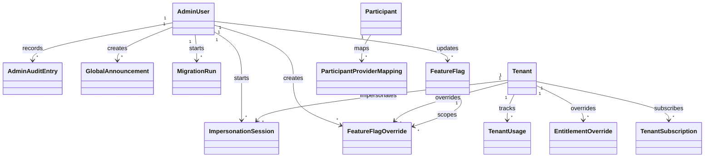

# Database Schema

This document describes the current PostgreSQL schema defined in [packages/core-api/prisma/schema.prisma](/Users/DDorazio/Library/CloudStorage/OneDrive-CURRICULUMASSOCIATESLLC/Documents/Claude/pool-master/packages/core-api/prisma/schema.prisma).

It has two goals:

- provide an ERD-oriented view of the major relationships
- provide a practical data dictionary with current application ownership

Status note:

- this document is grounded in the current Prisma schema, but some tables remain
  broader than the first-pass PoolMaster product surface
- active product/runtime truth should be read alongside:
  - [rules/architecture-rules.md](/Users/DDorazio/Library/CloudStorage/OneDrive-CURRICULUMASSOCIATESLLC/Documents/Claude/pool-master/rules/architecture-rules.md)
  - [plans/archive/2026-04-backend-completion/80-backend-dto-drift-remediation.md](/Users/DDorazio/Library/CloudStorage/OneDrive-CURRICULUMASSOCIATESLLC/Documents/Claude/pool-master/plans/archive/2026-04-backend-completion/80-backend-dto-drift-remediation.md)
- there is no active billing subsystem, no separate go-forward admin web app,
  and no current public-league/search-discovery product surface in the PoolMaster
  web app

## Scope And Conventions

- Source of truth: Prisma schema at [packages/core-api/prisma/schema.prisma](/Users/DDorazio/Library/CloudStorage/OneDrive-CURRICULUMASSOCIATESLLC/Documents/Claude/pool-master/packages/core-api/prisma/schema.prisma)
- Database: PostgreSQL
- Primary key pattern: UUID strings for almost all tables
- Timestamp convention: UTC `timestamptz` unless otherwise noted

### Surface Legend

`Web`
- primarily used by the member-facing web app

`Admin`
- primarily used by root-admin/support backend flows rather than a separate active admin app

`Both`
- used by both the web app and admin/support flows

`Internal`
- primarily backend, background-job, ingestion, or operational data; not a direct app-owned surface

Surface ownership is a practical classification, not a security boundary.

## ERD

### Identity, League, Contest, And Draft Core

### History, Notifications, Compliance, And Discovery

```mermaid
classDiagram
    class League
    class CommissionerAuditLog
    class CommissionerActionItem
    class LeagueRecord
    class RivalryRecord
    class LeagueSeasonSummary
    class Trophy
    class SeasonNote
    class Contest
    class TeamRosterHistory
    class PayoutHistory
    class ScoringCheckpoint
    class User
    class Notification
    class NotificationPreference
    class DeviceRegistration
    class UserLocalePreference
    class ConsentRecord
    class DataExportRequest
    class DeletionRequest
    class SelfExclusion
    class AccountEnforcement

    League "1" --> "*" CommissionerAuditLog : tracks
    League "1" --> "*" CommissionerActionItem : tracks
    League "1" --> "*" LeagueRecord : aggregates
    League "1" --> "*" RivalryRecord : aggregates
    League "1" --> "*" LeagueSeasonSummary : aggregates
    League "1" --> "*" Trophy : awards
    League "1" --> "*" SeasonNote : annotates
    Contest "1" --> "*" TeamRosterHistory : snapshots
    Contest "1" --> "*" PayoutHistory : pays
    Contest "1" --> "*" ScoringCheckpoint : checkpoints
    User "1" --> "*" Notification : receives
    User "1" --> "1" NotificationPreference : configures
    User "1" --> "*" DeviceRegistration : registers
    User "1" --> "1" UserLocalePreference : prefers
    User "1" --> "*" ConsentRecord : grants
    User "1" --> "*" DataExportRequest : requests
    User "1" --> "*" DeletionRequest : requests
    User "1" --> "*" SelfExclusion : activates
    User "1" --> "*" AccountEnforcement : receives
```

### Admin, Platform, Historical Billing, And Operations

## Data Dictionary

## Tenant And Identity

| Table | Purpose | Key Columns | Primary Surface |
|---|---|---|---|
| `tenants` | Top-level tenancy boundary for users, leagues, billing, and overrides | `id`, `slug`, plan defaults, locale/timezone/currency defaults | `Both` |
| `users` | Member-facing account identity and profile basics | `id`, `email`, `tenant_id`, `display_name`, locale/timezone fields | `Both` |
| `refresh_tokens` | Opaque refresh-token storage and revocation state | `token`, `user_id`, `expires_at`, `revoked_at` | `Both` |
| `user_locale_preferences` | Per-user display preferences beyond base user profile | language, timezone, time/date formats, currency | `Web` |

## League And Commissioner Operations

| Table | Purpose | Key Columns | Primary Surface |
|---|---|---|---|
| `leagues` | Core league record | `tenant_id`, `name`, `visibility`, `max_members`, `settings` | `Both` |
| `league_memberships` | User membership within a league plus role and commissioner permissions | `league_id`, `user_id`, `role`, `permissions` | `Both` |
| `league_invitations` | Email/link invites and acceptance tracking | `league_id`, `invite_code`, `invite_type`, `status`, `accepted_by` | `Web` |
| `commissioner_audit_log` | Immutable commissioner action history | `league_id`, `contest_id`, `actor_id`, `action`, `before_state`, `after_state` | `Both` |
| `commissioner_action_items` | Commissioner dashboard follow-up items | `league_id`, `contest_id`, `type`, `priority`, `resolved` | `Web` |
| `contest_templates` | Saved contest templates for repeated setup | `league_id`, `created_by`, sport/config JSON blobs, platform-template flags | `Both` |

## Sport, Season, And Participant Master Data

| Table | Purpose | Key Columns | Primary Surface |
|---|---|---|---|
| `sports` | Supported sport types and participant model metadata | `name`, `participant_type`, `stat_schema` | `Internal` |
| `seasons` | Tenant-scoped sport seasons used by contests | `sport_id`, `tenant_id`, `year`, `start_date`, `end_date` | `Both` |
| `participants` | Competitors/teams/drivers/golfers/etc. | `sport_id`, `name`, status/profile fields, metadata, external IDs | `Both` |
| `participant_season_records` | Season-level participant pricing, form, rankings, and stats | `participant_id`, `season`, `budget_price`, `rankings`, `season_stats` | `Both` |
| `participant_provider_mappings` | Mapping from external provider identity to internal participant | `participant_id`, `provider_id`, `external_id`, `confidence` | `Admin` |

## Contest Configuration, Pool Resolution, And Picks

| Table | Purpose | Key Columns | Primary Surface |
|---|---|---|---|
| `contests` | Core contest record and lifecycle | `league_id`, `season_id`, status, contest/scoring/selection types, schedule fields | `Both` |
| `selection_configs` | Selection-mode-specific configuration for a contest | `contest_id`, `selection_type`, draft/tier/budget/survivor/bracket fields | `Both` |
| `contest_pools` | Resolved participant pool configuration for a contest | `contest_id`, `sport`, `pool_type`, `config`, `pool_locked` | `Both` |
| `contest_participant_pool` | Contest-specific eligible participant set with pricing/tier availability | `contest_id`, `participant_id`, `cost`, `tier`, `is_available` | `Both` |
| `contest_matchups` | Matchup/slot rows for pick'em or bracket contests | `contest_id`, `period`, `matchup_index`, participant IDs, lock data | `Web` |
| `contest_entries` | Each member’s entry into a contest | `contest_id`, `league_membership_id`, `name`, `total_score`, `rank`, `is_eliminated` | `Web` |
| `roster_picks` | Roster-style participant selections tied to an entry | `entry_id`, `participant_id`, draft position metadata, `auto_picked` | `Web` |
| `contest_picks` | Survivor or pick'em selections by period/matchup | `entry_id`, `contest_id`, `participant_id`, `period`, `is_correct` | `Web` |
| `bracket_predictions` | Bracket-pick submission blob for an entry | `entry_id`, `contest_id`, `predictions`, `tiebreaker_value` | `Web` |
| `draft_sessions` | Live draft state for snake drafts | `contest_id`, `status`, current pick fields, timing fields | `Web` |
| `draft_picks` | Individual draft picks made during a draft session | `draft_session_id`, `entry_id`, `participant_id`, pick order fields | `Web` |

## Standings, Results, And League History

| Table | Purpose | Key Columns | Primary Surface |
|---|---|---|---|
| `contest_standings` | Current standings snapshot for active contests | `contest_id`, `entry_id`, `rank`, `total_score`, `last_updated_at` | `Web` |
| `contest_results` | Final contest results plus denormalized history fields | `contest_id`, `entry_id`, final rank/score, league/member history columns, `closed_at` | `Both` |
| `team_roster_history` | Immutable roster snapshot at lock/finalization time | `contest_id`, `entry_id`, `roster`, budget/tier history | `Web` |
| `payout_history` | Award/payout records linked to contest and member | `contest_id`, `league_id`, `league_membership_id`, `prize_type`, `amount` | `Both` |
| `scoring_checkpoints` | Intermediate scoring/standings checkpoints for review and history | `contest_id`, checkpoint label/type/order, `standings` JSON | `Internal` |
| `league_records` | League-level all-time or season records | `league_id`, `category`, `scope`, `record_value`, holder fields | `Web` |
| `rivalry_records` | Head-to-head summary between league members | `league_id`, `member_a_id`, `member_b_id`, shared contests and streaks | `Web` |
| `league_season_summaries` | Season recap summary for a league | `league_id`, `season_id`, counts, champions, highlights, note | `Web` |
| `trophies` | Award/trophy rows for members | `league_id`, `league_membership_id`, `trophy_type`, season/contest linkage | `Web` |
| `season_notes` | Commissioner-authored season notes | `league_id`, `season`, `content`, `author_id` | `Web` |
| `retention_configs` | Retention policy overrides for historical league data | `league_id`, result/roster/activity retention fields | `Admin` |

## Sports Data Integration And Ingestion Ops

| Table | Purpose | Key Columns | Primary Surface |
|---|---|---|---|
| `sport_events` | Imported external sporting events/tournaments/games | `provider_id`, `external_id`, `sport`, `status`, schedule fields | `Both` |
| `ingestion_jobs` | Poll/import job history and outcomes | job type, provider, sport, status, processed/error counts, error log | `Admin` |
| `provider_health_log` | Provider reliability and latency trend snapshots | `provider_id`, `status`, error rate, latency, failures, `recorded_at` | `Admin` |

## Notifications

| Table | Purpose | Key Columns | Primary Surface |
|---|---|---|---|
| `notifications` | In-app notification inbox rows | `user_id`, `event_type`, title/body, read/dismiss state | `Web` |
| `notification_preferences` | User notification preference configuration | `user_id`, DND flags, schedule, category preferences | `Web` |
| `notification_templates` | Admin-managed message templates per event type/version | push/email/in-app/sms template fields, `active`, `category` | `Admin` |
| `device_registrations` | Mobile/push device endpoints for notifications | `user_id`, platform, token, app/device fields, active status | `Internal` |
| `scheduled_notifications` | Delayed notification jobs awaiting send time | `event_type`, `fire_at`, source identity, `status` | `Internal` |
| `notification_delivery_log` | Channel delivery telemetry and failure history | event ID, `user_id`, `channel`, `status`, provider IDs, timing fields | `Admin` |

## Historical / Deferred Search And Discovery

| Table | Purpose | Key Columns | Primary Surface |
|---|---|---|---|
| `discoverable_leagues` | Public/discoverable league projection for search | league ID, sports, member/activity counts, join policy, hidden flag | `Web` |
| `discoverable_contests` | Public/discoverable contest projection for search | contest ID, league name, sport, status, draft/lock fields | `Web` |
| `discovery_reports` | Abuse/moderation reports against discoverable entities | `entity_type`, `entity_id`, `reported_by`, `reason`, `status` | `Admin` |

## Compliance And Responsible Gaming

| Table | Purpose | Key Columns | Primary Surface |
|---|---|---|---|
| `consent_records` | Legal/compliance consent history | `user_id`, `consent_type`, `granted`, version, IP/user agent | `Both` |
| `data_export_requests` | User data export workflow state | `user_id`, `status`, request/completion dates, download info | `Both` |
| `deletion_requests` | Account deletion workflow state | `user_id`, `status`, scheduling and completion fields | `Both` |
| `self_exclusions` | Self-exclusion lifecycle records | `user_id`, exclusion type/duration, active period | `Both` |
| `account_enforcement` | Manual/automated account enforcement actions | `user_id`, level, reason, trigger, time window, notes | `Admin` |
| `retention_job_runs` | Retention job execution history | job name, processed/deleted counts, timing, status, error | `Internal` |

## Admin And Platform Operations

| Table | Purpose | Key Columns | Primary Surface |
|---|---|---|---|
| `admin_users` | Admin-application principals and permission state | `email`, `role`, `permissions`, SSO/MFA fields, active state | `Admin` |
| `admin_audit_log` | Audit trail for admin actions | admin identity, resource type/id, before/after state, IP/UA | `Admin` |
| `feature_flags` | Global feature flag definitions and rollout metadata | `key`, `flag_type`, `enabled_globally`, rollout percentage, `updated_by` | `Admin` |
| `feature_flag_overrides` | Tenant-scoped flag overrides | `flag_id`, `tenant_id`, `enabled`, reason, creator | `Admin` |
| `global_announcements` | Site-wide/admin-authored announcements | severity, target, tenant targeting, active window | `Admin` |
| `impersonation_sessions` | Admin-initiated tenant impersonation sessions | `admin_user_id`, `tenant_id`, active lifecycle | `Admin` |
| `migration_runs` | Admin-triggered migration/repair run history | migration ID, status, options, progress, errors, starter | `Admin` |

## Billing And Entitlements

| Table | Purpose | Key Columns | Primary Surface |
|---|---|---|---|
| `plan_tiers` | Billable plan catalog and entitlement bundles | `slug`, prices, Stripe IDs, entitlement JSON, visibility | `Admin` |
| `tenant_usage` | Current counted usage per tenant/resource | `tenant_id`, `resource`, `current_count`, `counted_at` | `Both` |
| `entitlement_overrides` | Tenant-specific entitlement overrides | `tenant_id`, `entitlement_key`, `override_value`, expiry | `Admin` |
| `tenant_subscriptions` | Tenant billing/subscription state | Stripe IDs, plan tier slug, billing cycle, trial/period dates | `Both` |

## Practical Notes

### Tables most central to the web app

If you are tracing the primary member-facing product path, start with:

- `users`
- `league_memberships`
- `leagues`
- `contests`
- `selection_configs`
- `contest_entries`
- `roster_picks`
- `contest_picks`
- `draft_sessions`
- `contest_standings`
- `contest_results`
- `notifications`

### Tables most central to the admin app

If you are tracing the current admin product path, start with:

- `admin_users`
- `admin_audit_log`
- `feature_flags`
- `feature_flag_overrides`
- `global_announcements`
- `migration_runs`
- `ingestion_jobs`
- `provider_health_log`
- `notification_templates`
- `tenant_subscriptions`
- `tenant_usage`

### Tables shared across both application surfaces

The main shared operational records are:

- `tenants`
- `users`
- `refresh_tokens`
- `leagues`
- `league_memberships`
- `contests`
- `contest_results`
- `consent_records`
- `data_export_requests`
- `deletion_requests`
- `self_exclusions`
- `tenant_usage`
- `tenant_subscriptions`

These are the records where support/admin visibility and member-facing behavior most often meet.
