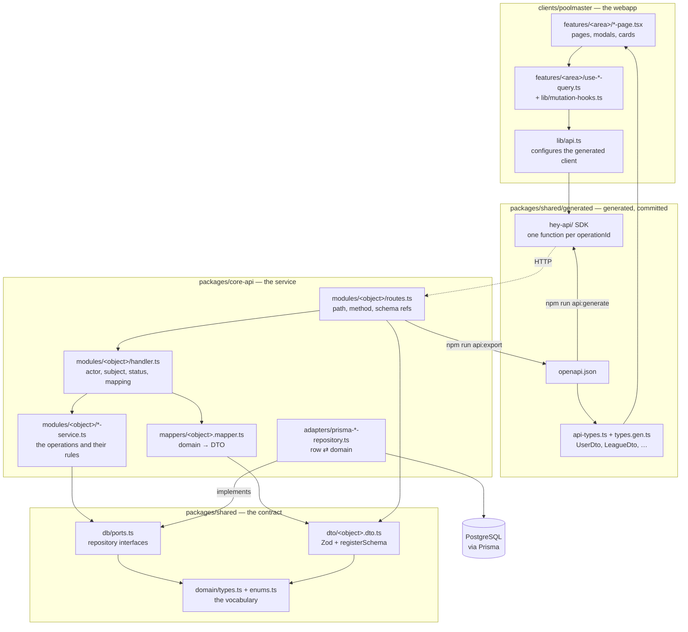
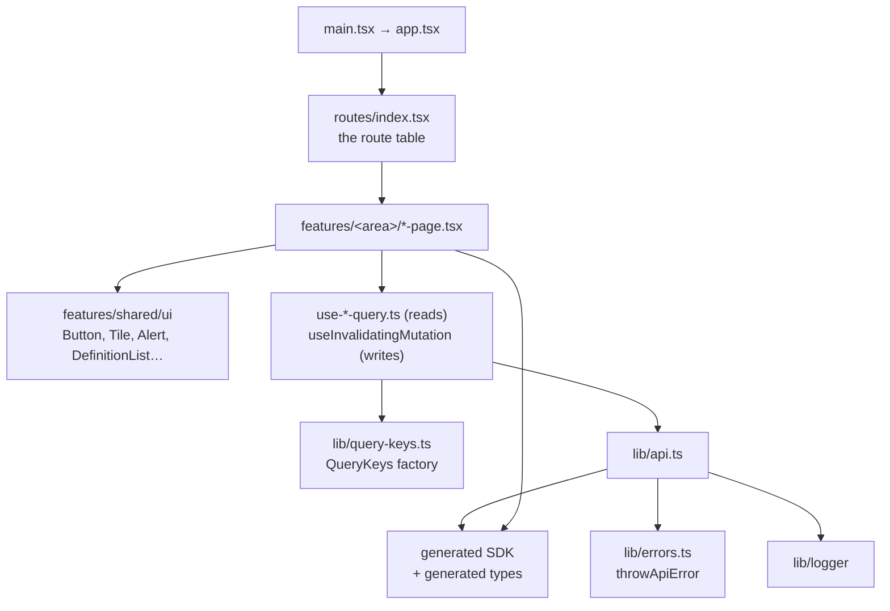
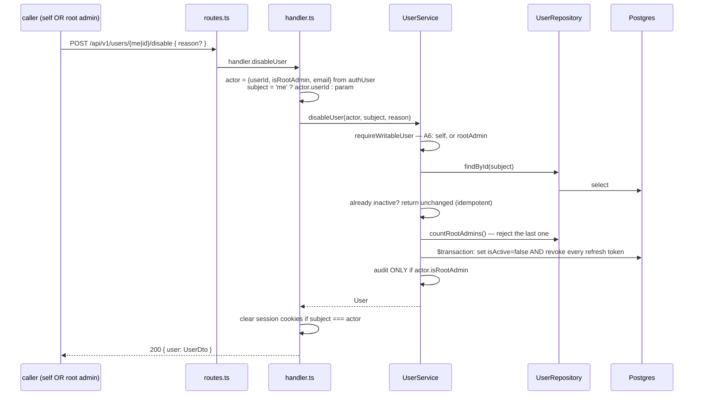

# PoolMaster — the layers, and the tests that belong to each

Written 2026-09-27, after the User / League / LeagueMembership / Squad refactor (#201, #202).
Its purpose is to describe **the structure that refactor actually produced**, so it can be
reviewed against what was intended. It was written from the code rather than from the existing
rules and docs, deliberately: a description that inherits the old framing cannot serve as a
check on it.

Each layer is described together with the tests that cover it — which suite, which folder, and
why there rather than somewhere else. Testing is not a separate section because a layer whose
tests live somewhere unrelated is a layer whose boundary nobody can see.

---

## 1. The shape in one picture



Two rules hold the picture together, and everything below is a consequence of them.

**The arrows into `domain/` only ever point inward.** `domain/types.ts` imports nothing —
not Prisma, not Zod, not Fastify. Ports are written in terms of domain types, DTOs are written
in terms of domain enums, adapters translate rows into domain objects. Nothing translates the
other way.

**The contract is generated, in one direction.** Routes declare Zod schemas, `api:export`
boots the app and writes `openapi.json`, `api:generate` writes the SDK and the TypeScript
types, and the webapp imports those. The webapp never hand-writes a request shape, and the
service never hand-writes a client.

---

## 2. The service, layer by layer

### 2.1 `packages/shared/domain` — the vocabulary

Plain TypeScript interfaces and enums for the things the product is about: `User`, `League`,
`LeagueMembership`, `Squad`, `SquadMembership`, `Contest`, and so on, plus the enums they use.

**What belongs here:** the fields an entity has, and the values its enums may take.

**What does not:** anything about storage (`passwordHash` is deliberately absent from `User`),
anything about transport, anything about who may read or write it. No imports.

The test that matters: **`tests/unit/shared/domain-models.test.ts`** and
**`enum-consistency.test.ts`**. They are here rather than beside the DTOs because what they
assert is that one vocabulary exists — that the enum a DTO validates against and the enum the
adapter maps to are the same enum. Prisma surfaces enum *member names* (`TWELVE_HOUR`) while
the domain holds *values* (`12H`), so this is a real check and not a tautology.

### 2.2 `packages/shared/db/ports.ts` — the repository interfaces

One interface per aggregate, written entirely in domain terms:

```ts
export interface UserRepository {
  findById(id: string): Promise<User | null>;
  findByEmail(email: string): Promise<User | null>;
  findAll(filters?: UserSearchFilters): Promise<User[]>;
  findByLeague(leagueId: string): Promise<User[]>;   // the scoped peer read
  findByIdentifier(identifier: string): Promise<User | null>;
  countRootAdmins(): Promise<number>;
  create(user: Omit<User, 'id' | 'createdAt' | 'updatedAt'>,
         credentials?: { passwordHash?: string }): Promise<User>;
  update(id: string, updates: UserUpdate): Promise<User>;
  delete(id: string): Promise<void>;
}
```

**What belongs here:** the queries the operations need, named for the question they answer.
`findByLeague` rather than `findAll(filters)` with a league filter, because the league *is* the
scope and there must be no way to call it unscoped. `countRootAdmins` rather than a generic
count, because the platform-lockout guard is the only caller.

**What does not:** paging (the API does not page — filters narrow a result, nothing slices it),
Prisma types, secrets. `UserUpdate` exists rather than `Partial<User>` for one concrete reason:
on the domain type the optional preferences are `string | undefined`, so `Partial<User>` cannot
express "clear my timezone".

**A port with no implementation is worse than a missing port.** `UserRepository` was declared
and exported for months with zero adapters and zero consumers, so every user query in the
codebase went straight to `prisma.user` — and from there to its own result shape. Two services
accumulated 36 and 26 raw calls that way. The port looked like the convention was being
followed.

Ports have no tests of their own. They are interfaces; their tests are their adapters'.

### 2.3 `packages/core-api/src/adapters` — one Prisma adapter per port

The only place that knows about Prisma rows, and the only place enum mapping happens:

```ts
const TIME_FORMAT_FROM_PRISMA: Record<PrismaUserTimeFormat, TimeFormat> = {
  TWELVE_HOUR: TimeFormat.TWELVE_HOUR,
  TWENTY_FOUR_HOUR: TimeFormat.TWENTY_FOUR_HOUR,
};
```

Written as exhaustive `Record`s rather than switches, so adding an enum member fails the build
here instead of falling through to `undefined` at runtime.

**What belongs here:** `where` clauses, `select`s, `orderBy`, the row→domain mapping, and the
null/undefined boundary (`row.timezone ?? undefined`).

**What does not:** business rules, authorization, anything spanning aggregates. The
eight-table user delete cascade is *not* in an adapter, because a port owns one aggregate and
that spans eight tables inside one transaction; it lives in `modules/users/user-lifecycle.ts`.

**Tests: `tests/integration/core-api/identity-repositories.integration.ts`, against real
Postgres, no mocks.** This is the one layer where a mock proves nothing: the question is
whether the query returns the right rows, whether `mode: 'insensitive'` actually is, whether
`null` actually clears a column. The clearing case is a worked example — mapping a `null`
through the enum `Record` returns `undefined`, which Prisma reads as *no change*, so "clear my
preference" would have silently done nothing. Only a real database catches that.

### 2.4 `packages/core-api/src/modules/<object>` — the operations

One folder per domain object, containing:

| File | Holds |
|---|---|
| `routes.ts` | path, method, request/response schema refs, and the module's dependency wiring |
| `handler.ts` | actor and subject resolution, status codes, cookies, DTO mapping |
| `*-service.ts` | the operations: their rules, guards, ordering and side effects |
| `<object>-errors.ts` | the error type carrying `code` + `statusCode` |
| helpers (`user-lifecycle.ts`, `squad-name.ts`, `permissions.ts`) | mechanics shared between operations |

**The service is where an operation lives, once.** `UserService` has one `disableUser`, and it
takes the actor and the subject:

```ts
async disableUser(actor: UserWriteActor, targetUserId: string, reason?: string): Promise<User>
```

When actor and subject are the same id it is self-service; when they differ the actor must be a
root admin. That rule is stated once, in `requireWritableUser`, and it is the single most
important structural claim in this document, because the alternative is what the code did
before: `/account/inactivate` and `/admin/users/:id/disable`, two implementations of one
operation, in two files, which had silently drifted apart —

- only the admin half carried the last-root-admin guard;
- only the account half refused to write an inactive account;
- only the admin half wrote an audit entry;
- only the admin half blocked self-demotion, duplicating a count that already covered it.

None of those differences were decisions. They were what happens when "who is asking" is
encoded in *which file you are in* instead of in a parameter.

**What belongs in the service:** the guards and their order, idempotence, what shares a
transaction, what gets audited, and which typed error each failure raises.

**What does not:** HTTP. A service never sees a `request`, never sets a cookie, never picks a
status code. It also never reaches past its ports for a single-aggregate read — the exceptions
are explicit and commented: `$transaction`, the cross-table cascade, the refresh-token revoke,
and the one `passwordHash` read the port deliberately never serves.

**Tests: `tests/unit/core-api/<object>-service.test.ts`, with port fakes from
`tests/support/repo-fakes.ts`.** One suite per service — `user-service.test.ts` replaced three
suites when three implementations became one, and the unit count fell for the first time in the
refactor, which is the outcome to expect.

What a service test may assert, learned the hard way:

| Assert | Because |
|---|---|
| the returned value | it is the operation's output |
| the typed error (`code`, `statusCode`) | it is the published contract |
| the **absence** of a write | it is the only way idempotence and a short-circuiting guard are visible |
| that two writes shared one `$transaction` | atomicity has no other observable |
| the audit entry's content | the audit has no return value |
| that **both callers reach the same operation** | this is what the collapse bought |

What it may not: which repository method was called with what. That assertion pins the call
graph, breaks on refactors that change nothing, and the thing it stands in for — does the query
return the right rows — belongs to the adapter's integration test. The one deliberate exception
is a service that holds no state and issues no query, where the update it hands the port *is*
its output; that is stated in the test file that does it.

### 2.5 `packages/core-api/src/mappers` — domain → DTO

One projection per object. `toUserDto(user: User): UserDto`, and nothing else.

There were **four** of these for `User` before the refactor — one in `auth.mapper.ts` over a
local row interface, one in `account.mapper.ts`, a private one in the admin handler, and a
fifth shape (`UserProfile`) invented inside `auth-service.ts`. Three of the four carried their
own copy of the row→domain enum mapping, which belongs in the adapter.

**What belongs here:** field selection and `Date → ISO string`. Nothing conditional on the
caller.

**Tests:** mappers are covered through the layer that uses them — the integration contract
tests parse real responses against the DTO schema, which is a stronger check than asserting a
mapper's return value against a literal. Two mappers have their own unit tests
(`leagues-audit-mapper.test.ts`, `provider-sync-mapper.test.ts`) because they do real
transformation rather than projection.

A mapper's **declared return type is the check**. `mapLeagueMembershipToDto` had none for
months, which meant `LeagueMembershipDto` was a registered OpenAPI component with nothing
type-checked against it: a field added to the schema or dropped from the mapper compiled either
way, and the shape held together only because Fastify's serializer dropped unknown keys.

### 2.6 `packages/shared/dto` — the published contract

Zod schemas, the types inferred from them, and a `registerSchema` call that publishes each one
as a named OpenAPI component.

```ts
export const UserDtoSchema = z.object({ /* … */ });
export type UserDto = z.infer<typeof UserDtoSchema>;
registerSchema('UserDto', UserDtoSchema);
```

**One DTO per entity and per edge.** Not per caller, not per view. The refactor deleted
`LeagueSummaryDto` + `LeagueDetailDto` (the second was the first plus one field),
`LeagueMemberDto` (an edge with three of the user's columns flattened onto it),
`AdminTeamSummaryDto`, `AdminTeamOwnerSummaryDto`, and three DTOs that existed only to name a
block of viewer flags.

**No viewer context on an entity DTO.** This is the rule with the most consequences. A
`LeagueDto` used to carry `memberType`, `leagueRelationship` and `isRootAdmin`, so two
requesters got *different values for the same league* — which makes the DTO not a value of the
entity, defeats caching, and was the seed of the admin/member DTO split. The viewer's
relationship now travels as the canonical edges, once per league:

```
GET /api/v1/users/me            → UserResponse            (who I am, incl. isRootAdmin)
GET /api/v1/leagues/code/:code  → LeagueContextResponse   (the league + MY membership + MY squad membership)
GET /api/v1/leagues             → LeagueListResponse      (leagues + MY memberships as an array)
everything else league-scoped   → the entity, and nothing about me
```

The client fetches the context call once on league selection and holds it for the session, so
every later response repeating it would be duplication rather than delivery.

**Tests: `tests/unit/shared/`.** `openapi-named-components.test.ts` asserts that every
registered component is actually published *and* that no frontend file re-derives a type by
indexing into a response map. `openapi-nullable-3-1.test.ts` asserts the generator emits
`| null` where the schema says nullable. `schema-registry.test.ts` covers registration itself.
These are unit tests over generated artifacts, which is why they sit in `tests/unit/shared/`
rather than beside a service: what they check is the contract, not any behaviour.

### 2.7 `routes.ts` — the published surface, and the wiring

A route declares its path, its method, and `schemaRef('UserResponse')`. It is also where
dependencies are constructed — the adapters, the services, the handlers:

```ts
export function usersModule(fastify: FastifyInstance): void {
  const prisma = getAppPrisma(fastify);
  const users = new PrismaUserRepository(prisma);
  const service = new UserService(users, prisma, fastify.log);
  const handlers = createUserHandlers(service, authService);
  fastify.get('/:userId', { schema: { /* … */ }, handler: handlers.readUser });
}
```

This is the composition root for the module: the only place that knows both an interface and
its implementation.

**One route per operation, with the subject as a parameter.** `/api/v1/users/:userId/disable`,
where `me` resolves to the caller, replaced `/account/inactivate` and
`/admin/users/:id/disable`. Sixteen routes across `/account/*`, `/admin/users/*` and `/auth/me`
became eleven under `/users`.

A consequence worth stating: moving the user list out from under `/api/v1/admin` separated two
failures the admin prefix had answered identically. Anonymous is now `401
AUTH_SESSION_REQUIRED`; authenticated-but-not-a-root-admin is `403
ROOT_ADMIN_ACCESS_REQUIRED`.

**Tests, at two levels, for different questions.**

*`tests/integration/core-api/contract-verification-*.integration.ts`* — boots the app in
process, `inject()`s a request, and parses the response with the DTO schema:

```ts
const res = await getApp().inject({ method: 'GET', url: '/api/v1/users/me', headers });
expect(res.statusCode).toBe(200);
expect(UserResponseSchema.safeParse(res.json()).success).toBe(true);
```

This is the cheapest place to catch a response that no longer matches its schema, and it
catches a whole class of error the type system cannot: a handler that sent a raw domain object
and relied on the serializer.

*`tests/functional/*.functional.ts`* — a real server on a port, driven through the **generated
SDK**, which is what makes it different from the integration tests rather than merely slower:

```ts
const response = await disableUser({ client: rootAdmin.client, path: { userId }, body: {} });
expect(response.response.status).toBe(200);
expect(response.data?.user.isActive).toBe(false);
```

If a route is renamed, or a parameter added, or an envelope changed, the SDK stops compiling
here. That is the test that proves the published contract and the client agree, and it is why
these suites import from `@poolmaster/shared/generated/hey-api` rather than using `inject`.

### 2.8 `plugins/` and `core/` — the cross-cutting parts

`plugins/` holds Fastify plugins: `auth-guard` (validates the access token and attaches
`request.authUser`), `admin-auth` (the older root-admin gate, still guarding what remains under
`/admin/*`), `request-logging-context`, `schema-components`, `etag-support`, `swagger`,
`health`, `poll-config`, `admin-audit-hook`.

`core/` holds process-level helpers with no domain content: `config`, `error-handler`
(`sendError`), `logger`, `prisma-context`, `session-cookies`, `admin-permissions`.

One thing to know about `request.authUser`: it carries `isRootAdmin` **from the token claim**.
Because the user operations take their actor from the authenticated request, a promotion
written straight to the database does not take effect until the next token is issued. The old
`/admin/*` prefix re-read the user row on every request, which made a mid-session promotion
appear immediate. This is a real behavioural change and the functional builder that promotes a
user now re-issues its session.

---

## 3. The webapp, layer by layer



### 3.1 `lib/` — the boundary to the service

`lib/api.ts` is the **only** place that configures the generated client: base URL, cookie
credentials, the CSRF header on state-changing methods, the client trace id, and the
401-triggered refresh-and-retry. Everything else imports operations *through* it
(`import { disableUser } from '@/lib/api'`).

`lib/query-keys.ts` is a single `QueryKeys` factory. Every key is built there, so invalidation
after a mutation names the same key the read used — the failure this prevents is a page that
mutates successfully and then shows stale data because two call sites spelled a key
differently. `tests/unit/poolmaster/query-keys-factory.test.ts` enforces that keys come from
the factory.

`lib/mutation-hooks.ts` wraps mutations so each one declares what it invalidates.
`lib/errors.ts` turns an SDK error envelope into a thrown error. `lib/logger` batches client
logs to the ingest route. `lib/config.ts`, `lib/cookies.ts`, `lib/version-info.ts` are what
their names say.

**TanStack Query is the state store, deliberately, and there is no Zustand mirror** — the
server response *is* the state, and a second copy of it is a shadow.
`auth-state-ownership.test.ts` enforces that.

### 3.2 `features/<area>/` — pages and everything they need

`account`, `app-shell`, `auth`, `contests`, `leagues`, `root-admin`, `teams`, and `shared/ui`.
A feature folder holds its pages, its modals and cards, its query hooks, its routing helpers
and its local caches — and its tests, colocated:

```
features/leagues/
  leagues-page.tsx            leagues-page.test.tsx
  league-detail-page.tsx      league-detail-page.test.tsx
  create-league-modal.tsx     create-league-modal.test.tsx
  league-routing.ts           league-routing.test.ts
  use-leagues-query.ts
  league-cache.ts
  test/fixtures.ts
```

**Types come from the generated SDK, never re-derived.** `type RootAdminUser = UserDto`, not
`ListUsersResponses[200]['users'][number]`. The second form looks equivalent and is not: it
couples a component to the *shape of a response map*, so the component has to change when an
envelope changes even though the entity did not. `openapi-named-components.test.ts` fails the
build on it.

`features/shared/ui` holds the design-system primitives. Pages compose them; they hold no
domain knowledge.

### 3.3 Where the webapp's tests live, and why it differs from the service

**Colocated, next to the file they test, run by vitest from inside the client workspace** —
whereas every backend test lives centrally under `tests/`, run by jest from the repo root.

That is a real asymmetry, and it is not an accident: the webapp's tests need the Vite module
graph (path aliases, JSX transform, CSS imports) and jsdom, which is vitest's environment and
not the root jest project's. The split follows the runner. The consequence to know is that
`npm run test:unit` does **not** include the webapp, and `tests/unit/poolmaster/` contains only
the few webapp-adjacent checks that need no DOM — the query-key factory rule and the local
ESLint rules.

`clients/poolmaster/src/test/msw-api.ts` is the request harness: it maps each SDK operation to a
method and path and mocks it. It is worth knowing that this is a **hand-maintained mirror of
the generated route table**, and that it was stale in this refactor's favour — still listing
`/api/v1/account/*` after those routes were deleted. Together with
`packages/shared/api-routes.ts` there are two hand-written copies of something that is
generated, which is the shadow pattern this whole refactor exists to remove, one level up.

---

## 4. Two flows end to end

### 4.1 A read: the league-context call

```
GET /api/v1/leagues/code/MASTERS
  │
  ├─ plugins/auth-guard          verifies the access token, sets request.authUser
  ├─ modules/leagues/routes.ts   matches, declares 200 → schemaRef('LeagueContextResponse')
  ├─ modules/leagues/handler.ts  userId = authUser.userId
  │    ├─ leagueService.getLeagueWithMembersByCode('MASTERS')
  │    │     └─ LeagueRepository.findByCode  → adapters/prisma-league-repository
  │    │           └─ prisma.league.findUnique → row → League
  │    ├─ 403 unless the viewer has an ACTIVE membership, or is a root admin
  │    ├─ squadMembershipRepo.findByLeagueAndUser(leagueId, userId)
  │    ├─ userRepo.findById(userId)            the viewer, for the embedded UserDto
  │    └─ mappers: toLeagueDto, mapLeagueMembershipToDto, toSquadMembershipDto
  └─ Fastify serializes against LeagueContextResponse

{ league: LeagueDto, membership: LeagueMembershipDto | null, squadMembership: … | null }
```

The webapp calls it once per league selection, caches it at
`QueryKeys.leagues.detail(leagueCode)`, and every other league-scoped read afterwards returns
entities with no viewer fields on them.

Covered at three levels, each answering a different question: does the query scope correctly
(integration, real Postgres), does the response match its schema (integration contract
verification), does the generated SDK still call it correctly (functional).

### 4.2 A write: disabling a user, by either caller



Three things in that diagram used to be spread across two files that disagreed: the guard, the
transaction, and the audit. The flag and the session revoke share one transaction because two
separate statements left a window where a user was inactive in the UI and could still refresh a
session for the token's lifetime. The audit is keyed on the actor because the entry records an
exercise of root-admin authority, and self-service is not that.

---

## 5. Where the boundaries are still soft

Stated plainly, because a description that only lists the tidy parts is not much use as a
review document.

**Five user reads still go straight to Prisma** — in `leagues/invitation-service.ts` (×2),
`leagues/member-lifecycle.ts`, `squads/default-squad.ts` and `contests/service.ts`. Each is a
plain read the port covers exactly. What blocks them is not the read: it is that those services
take twelve, nine and seven **positional constructor parameters** with trailing optionals, so
adding a dependency mid-list silently shifts every argument at every call site. Converting them
produced exactly that — a Prisma mock landing in a logger slot, a repository in a base-URL
slot — and was reverted. The fix is to replace those parameter lists with options objects.

**Two user reads stay on Prisma by design.** `admin/health-service.ts` counts users for a
platform metric, which is not an aggregate read. `plugins/admin-auth.ts` re-reads the user row
per request, which is tracked separately and is now inconsistent with the user routes.

**Three route maps describe the same routes.** The Fastify registrations are the truth,
`openapi.json` is generated from them, and then `packages/shared/api-routes.ts` and
`clients/poolmaster/src/test/msw-api.ts` are maintained by hand.

**`logAdminAction` holds a module-level Prisma singleton** set at boot, rather than being
injected. It also takes no transaction client, which is why every audit call in this refactor is
written deliberately *after* its transaction commits: a call inside the callback was never
enrolled in it, so the entry committed immediately and would have survived a rollback,
recording an action that did not happen.

**The webapp has moved (updated 2026-09-27).** This section previously said phase 1 was
backend-only and the webapp was expected not to compile. Slice 1's frontend is now reconnected
to the contract, so section 3 describes a finished state for the objects slice 1 covers —
`User`, `League`, `LeagueMembership`, `Squad`. Slices 2–4 have not been reconnected, so it is
not yet a finished state for events, contests or platform operations.

**The squad list is the member roster (corrected 2026-09-27).** An earlier version of this
section said there was no league-members surface. That was wrong. `ensureDefaultSquadForLeagueMember`
runs on both paths that create a `LeagueMembership`, and accepting a squad-owner invitation creates
a `LeagueMembership` plus a `SquadMembership`, so every active member has exactly one active squad
and appears on `teams-page.tsx`. Reading the member layer, expect the squad list — not a separate
roster screen — to be its UI.

**The invariant that makes it true, now asserted (#218).** Every ACTIVE `LeagueMembership` has
exactly one ACTIVE `SquadMembership` in that league, and no ACTIVE squad membership belongs to a
non-member. `SquadService.removeOwner` used to break it — it ended the squad membership and left the
league membership, so a removed co-owner kept league access while vanishing from every surface that
lists people. It now routes through `inactivateLeagueMemberUnit` like league removal and squad
inactivation do, and
`tests/integration/core-api/league-squad-membership-invariant.integration.ts` checks the invariant
against the database after each way a membership can begin or end.

**League and squad management never touches a user's account (#218).**
`inactivateLeagueMemberUnit` used to deactivate the user and revoke their refresh tokens when the
league they were leaving was their last one. That let a relationship ending mutate the object's
lifecycle, and it made recovery impossible: `login` refuses an inactive account, accepting an
invitation needs a session, and only a root admin can re-enable. The unit now takes no Prisma
client, so the guarantee is structural. Account state belongs to the user (self-service disable) and
to a root admin.

**Three model facts to know before working on squads.** `SquadMembership` is unique on
`(leagueId, userId)`, so one member holds at most one squad per league and an existing member cannot
join a second squad (`SQUAD_MEMBERSHIP_CONFLICT`). Co-ownership therefore only arises for somebody
who joins the league *through* a squad-owner invitation. And `inviteOwner` auto-accepts when the
invited email already belongs to a PoolMaster user, provisioning them on the spot and returning the
invitation `ACCEPTED`. The pending-then-accept path is only for an email with no account, which
`POST /api/v1/team-invitations/register` serves (#217): it registers, joins the league and joins the
squad in one request, and creates the account with the **invited** email rather than one the caller
supplies, because a squad-owner invitation grants league membership.

**Operations with no frontend caller, as of this pass.** `removeMember` (gets one in #218),
`revokeInviteLink` (the league invite *link*, distinct from the squad-owner invitation revoke that
is wired), `importMembers` (#220), and `getLeagueDashboard` (#221 — the only one that returns real
data). Their siblings `resolveActionItem`, `getLeagueAuditLog`, `getMemberAuditLog` and `copySeason`
were deleted: the first three were APIs in front of tables nothing writes to, and the fourth had no
caller and was descoped.

**Two live reads sit in front of a table nothing writes.** `AuditService.logAction` is the only
writer to `CommissionerAuditLog` and has zero callers, so `getContestAuditLog` — still routed at
`GET /contests/:contestId/audit-log` — always returns an empty array. Left in place because
contests are slice 3's cluster and #205 has to decide how many audit tables there should be.
Likewise `getLeagueDashboard`'s `actionItems` can only be populated by writing
`CommissionerActionItem` directly, which only an integration test does.
