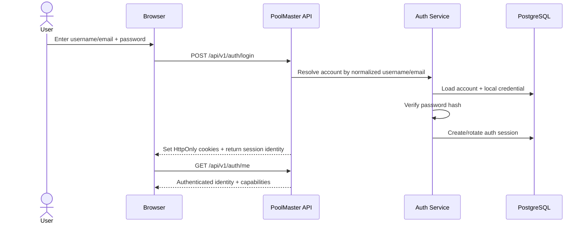
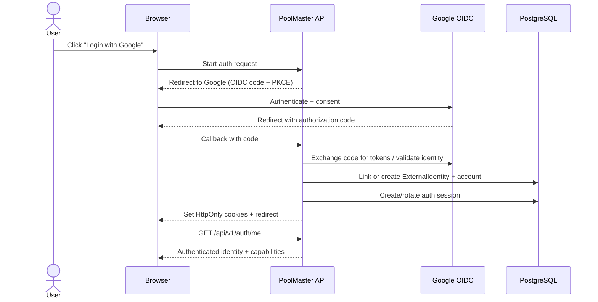
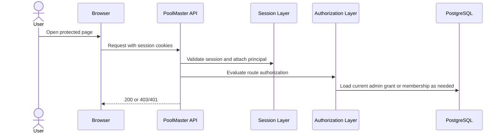

# Standard Authentication And Authorization Model For PoolMaster

This document recommends a conventional consumer-product authentication and authorization model for PoolMaster, based on:

- local account login with `username or email + password`
- federated login with Google via OpenID Connect
- backend-owned `HttpOnly` cookie sessions
- database-backed authorization for both platform and league-scoped actions

It is intentionally a **target-state** document. It answers: "What is the normal, standard approach we should unify onto?"

## External Guidance

This recommendation is based on common security and identity guidance from primary sources:

- OWASP Authentication Cheat Sheet:
  - users may log in with a verified email address or a separate username
  - passwords should follow modern strength/storage guidance
- OWASP Session Management Cheat Sheet:
  - `HttpOnly` cookies protect session identifiers from JavaScript access
  - `SameSite` and cookie attributes should be used intentionally
  - `localStorage` persists across sessions and is browser-readable
- Google Sign-In / OIDC docs:
  - Google supports OpenID Connect for authentication
  - standard authorization-code-based login is the baseline web pattern
- OAuth 2.0 Security BCP:
  - PKCE should be used
  - browser/OAuth flows should be hardened with modern best practices

Source links:

- [OWASP Authentication Cheat Sheet](https://cheatsheetseries.owasp.org/cheatsheets/Authentication_Cheat_Sheet.html)
- [OWASP Session Management Cheat Sheet](https://cheatsheetseries.owasp.org/cheatsheets/Session_Management_Cheat_Sheet.html)
- [Google OpenID Connect](https://developers.google.com/identity/openid-connect/openid-connect)
- [RFC 9700: OAuth 2.0 Security Best Current Practice](https://www.rfc-editor.org/rfc/rfc9700)

## Recommended Standard Model

### 1. One account system for all human users

Use one account identity model for:

- normal PoolMaster members
- commissioners
- platform admins

Recommendation:

- every human has one core account
- that account may have:
  - a local password credential
  - one or more external identities
  - optional admin capability

This is more standard than maintaining one user identity model for the product and a separate browser-auth identity model for admin.

### 2. Login methods

PoolMaster should support:

- local login:
  - `username or email + password`
- Google login:
  - OpenID Connect
  - authorization code flow
  - PKCE

The important point is that both methods terminate into the same internal account and the same session model.

### 3. Backend-owned sessions, not browser-owned tokens

The browser should not store access tokens in `localStorage`.

Use:

- short-lived `HttpOnly`, `Secure` auth/session cookie
- long-lived refresh/session continuation cookie
- backend-managed session revocation and rotation

The frontend should learn who the user is by calling a backend-authenticated session endpoint such as:

- `GET /api/v1/auth/me`

This is the normal pattern for modern consumer sites that want web security and operational simplicity.

### 4. Authentication and authorization stay separate

Authentication answers:

- who is this caller?

Authorization answers:

- what can this caller do?

PoolMaster should keep these layers separate:

- authentication:
  - local password or Google OIDC
  - verified backend session
- authorization:
  - platform role/permissions
  - tenant relationships
  - league membership
  - commissioner permissions

## Recommended PoolMaster Identity Model

### Core account

Use one primary account record for each person.

For PoolMaster, the current [User model](../packages/core-api/prisma/schema.prisma) is the natural starting point, but it should evolve.

Recommended account fields:

- `id`
- `email`
- `emailVerifiedAt`
- `username`
- `usernameNormalized`
- `displayName`
- `status`
- `createdAt`
- `updatedAt`

Important behavior:

- `email` remains unique
- `username` is optional at first, but unique when present
- login accepts either verified email or username
- credential lookups should normalize input before matching

### Local credential

Store local-password credentials separately from the generic account profile concerns.

At minimum:

- password hash
- password algorithm version
- password updated at
- optional password-reset metadata

PoolMaster can keep this on `User` initially if needed, but a dedicated credential model is more standard once multiple auth methods exist.

### External identities

The current `authProvider` / `authId` fields on `User` are serviceable for one provider, but not ideal for long-term account linking.

Recommendation:

- add an `ExternalIdentity` table

Suggested fields:

- `id`
- `userId`
- `provider`
- `providerSubject`
- `emailAtProvider`
- `profileSnapshot`
- `createdAt`
- `updatedAt`

This supports:

- Google login
- future Apple/Microsoft/etc.
- linked-account management
- safer account merging rules

### Session model

The current `RefreshToken` table is a useful foundation, but the target model should be described as session-oriented, not frontend-token-oriented.

Recommendation:

- evolve toward an `AuthSession` concept

Suggested session fields:

- `id`
- `userId`
- `refreshTokenHash` or session secret hash
- `expiresAt`
- `revokedAt`
- `lastSeenAt`
- `ipAddress`
- `userAgent`
- `deviceLabel`
- `createdAt`

This supports:

- session listing
- remote logout
- suspicious-session handling
- clean refresh rotation

### Admin capability

The most standard model is not "separate auth for admins". It is:

- one authenticated account
- separate admin grants/roles

For PoolMaster, the current `AdminUser` table should move toward being a linked admin-capability record rather than a parallel identity.

Recommended direction:

- add `userId` to the admin capability model
- treat admin role/permissions as an authorization grant on top of the same account

That lets one human:

- use the web app as a member/commissioner
- use the admin app as a platform operator
- authenticate once with one account system

## Recommended Authorization Model

### Platform authorization

Use RBAC for admin/platform functions:

- `SUPER_ADMIN`
- `OPERATIONS`
- `SUPPORT`
- `DATA_OPS`
- `VIEWER`

And keep permissions DB-backed:

- `tenant.view`
- `tenant.manage`
- `platform.health`
- `audit.view`
- `announcement.manage`
- etc.

This is already close to PoolMaster's current admin design and should be preserved.

### Product authorization

Do not replace league-scoped authorization with token claims.

Keep resource/relationship-based checks for:

- tenant membership
- league membership
- commissioner permissions
- contest participation rights

This is the correct standard pattern for a collaborative product domain where authorization depends on current relationships, not only static roles.

### Combined model

So the standard PoolMaster authorization stack should be:

- session proves identity
- platform RBAC controls admin-app capabilities
- relationship-based authorization controls product/domain actions

## Recommended User Flows

### Local login

### Google login

### Protected request

## What This Means For PoolMaster Specifically

### Recommended product decisions

1. Keep one account system for all humans.
2. Support:
   - local username/email + password
   - Google OIDC login
3. Remove browser token storage.
4. Use backend-owned `HttpOnly` cookie sessions.
5. Keep admin permissions DB-backed.
6. Keep league/commissioner permissions DB-backed.
7. Use `/api/v1/auth/me` as the trusted session/identity read for both apps.

### Recommended schema direction

High-value schema changes to plan for:

- `users`
  - add username and verification/status fields
- `external_identities`
  - replace single-provider coupling
- `auth_sessions`
  - evolve from refresh-token-only semantics
- `admin_users`
  - link to the core account identity instead of acting as a separate browser-auth identity

### Recommended frontend direction

Both web and admin should:

- stop reading/storing auth tokens
- rely on cookie-authenticated requests
- fetch current identity from the backend
- render based on backend-truthful capabilities

## Comparison To Plan 36

### Where Plan 36 already aligns

Plan 36 already correctly moves toward:

- one auth model for web and admin
- backend-owned `HttpOnly` cookie sessions
- no `localStorage` access tokens
- removal of admin identity headers
- DB-backed admin authorization
- DB-backed league-scoped authorization

### What this standard-model review adds

Plan 36 should now be read with these stronger product-level decisions:

1. The target is not just "unify auth"; it is "adopt the normal consumer app pattern".
2. The supported login methods should be:
   - local username/email + password
   - Google OIDC
3. PoolMaster should move from single-provider user fields toward linked external identities.
4. PoolMaster should move from refresh-token-centric language toward a first-class session model.
5. The long-term target should be one account identity with optional admin capability, not a separate browser-auth admin identity.

### Recommended changes to Plan 36

Plan 36 should keep its migration structure, but the target state should explicitly include:

- local credentials plus Google OIDC
- username-or-email login support
- `ExternalIdentity` support
- session-table/session-lifecycle language
- a linked admin-capability model on top of the core account identity

## Bottom-Line Recommendation

PoolMaster should not unify on the current web-app implementation details.

It should unify on the standard modern pattern:

- one account system
- local login and Google login
- backend-owned `HttpOnly` sessions
- frontend identity reads from the backend
- RBAC for platform/admin
- relationship-based authorization for leagues and contests

That is the cleanest path to a normal, durable AuthN/AuthZ architecture.
